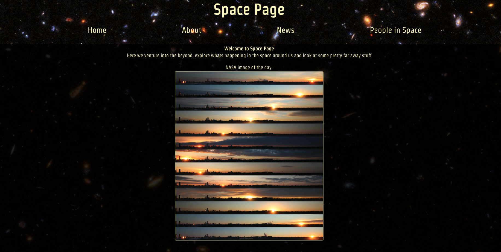
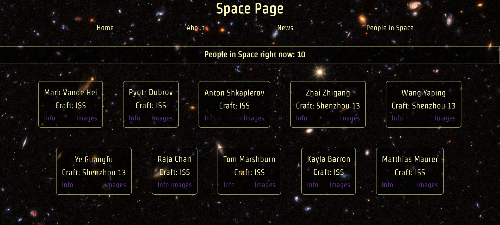

# General Assembly - project 2

# SpacePage :rocket:

Two day paired project - a multipage React app that retrieves data from external APIs


## Brief:

- Consume a public API.
- Have several components - At least one classical and one functional.
- The app can have a router with several ‘pages’.
- Include wireframes.
- Be deployed online and accessible to the public.

## Goal:

To take the brief and run with it, we really wanted to use as many APIs as possible and get the most out of this two day hackathon project.

## Deployed Link:

https://space-page.netlify.app/

## Technologies Used:

- React
- JSX
- Axios
- SCSS
- React Router DOM
- JavaScript

## Overview:

The project was a 38 hour hackathon and we were split into pairs to tackle it. My partner and I decided to use space themed APIs and created ‘Space Page’ where casual science fans can view the latest astro science news articles, get updates on which astronauts are currently in space & see the NASA astronomy picture of the day.

Using React & React-Router-DOM for the first time, we built a multipage website. Axios requests are how we retrieve datasets from various APIs, storing them in stateful variables and displaying the data with React components. Using SASS we styled the site with what little time we had.
The first step was to build the simplest component, a container which would display the NASA astronomy picture of the day - once we were able to retrieve the data, save the relevant piece to a stateful variable and display it in the container, the ball was rolling. It was then just a case of following that same process for the other components we wanted to include. With the bulk of the work done we just had to test and style the site which took maybe 25% of the time allocated to the project.

We wanted the design to be fun and embody the excitement of people checking in on the latest space news, so we included the game of another member of our cohort at General Assembly and embedded that into our website allowing visitors to go and play Space Invaders as they are waiting for the next rocket to launch.

## Build:

We started the work by building the individual cards required to show just one news article pulled from the API. To do this we decided on just using the title, url, image and summary provided. Once we set our mind on those we built the following:

```

const SpaceCard = ({
  title,
  url,
  imageUrl,
  summary,

}) => {
  return (
    <div className='cardsDiv'>
      <div className='cardsText'>
        <h2><a href={url}> {title}</a> </h2>
        <p> {summary} </p>
      </div>
      <picture className='cardsPic'>
        
      </picture>
    </div>
  )
}

export default SpaceCard

```

The space card then plugged into the SpaceList which meant we could generate a list of articles from the API that all contained the same information and could be aligned and ordered on our page.

```

import SpaceCard from './SpaceCard'
import { useState } from 'react'
import { useEffect } from 'react'
import axios from 'axios'

const SpaceList = () => {
    const [articles, setArticles] = useState([])

    useEffect(() => {
        const getArticles = async () => {
            const response = await axios.get('https://api.spaceflightnewsapi.net/v3/articles')
            setArticles([...articles, ...response.data])
        }
        getArticles()
    })

    return (
        <div className='spaceList'>
            {articles.map((article) => (
                <SpaceCard key={article.id} {...article} />
            ))}
        </div>
    )

}

export default SpaceList

```

On the page listing the astronauts currently in space we wanted to add more that just a list, so I looked into creating clickable text that would pull the astronauts name and input it into the base of a Wikipedia search and aldo a Google images search by breaking down the urls on both websites.

```

import React from 'react'

const wikiUrl = 'https://en.wikipedia.org/wiki/'
const googUrl = 'http://images.google.com/images?q='

const AstronautCard = ({name, craft}) => {
    return (
        <div className="card">

            <p>{name}</p>
            <p className="middleP">Craft: {craft}</p>
            <div className="astrolinks">
            <a rel="noreferrer" target="_blank" href={wikiUrl + name} >
            <p>Info</p>
            </a>
            <a rel="noreferrer" target="_blank" href={googUrl+ name} >
            <p>Images</p>
           </a>
           </div>

        </div>
    )
}

export default AstronautCard

```

Finally dealing with the constant image size change in NASA’s image of the day API, posed an issue for a while when taking into account working from a big screen and a normal screen. However once we changed from sizing in pixels to percentages that issue was solved straight away.

## Visuals:






## Challenges + Wins:

The best win for me was seeing how far we had come from our first project to this project. The challenge was learning to use Github efficiently, as it was the first time we were using our own branches on a project and both pushing to one main repo. At the end of day one of the projects my partners Git crashed so we both worked off my laptop and I wrote everything so it was a great way of hitting a problem and creating a work around to make sure the project could be completed on time.

Another challenge was our final API we used wasn’t secure, so when we hosted on Netlify nothing would appear for that page unless you turned off secure browsing. This issue was never resolved, but it did teach us a valuable lesson in secure vs not-secure APIs.

## Future Features + Key Learning:

I learnt a valuable lesson in teamwork and the pace I can work at when under tight time constraints, but also I learnt to trust in my own capabilities.
